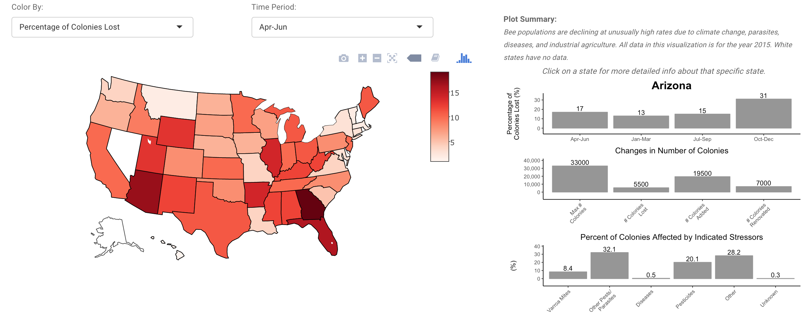
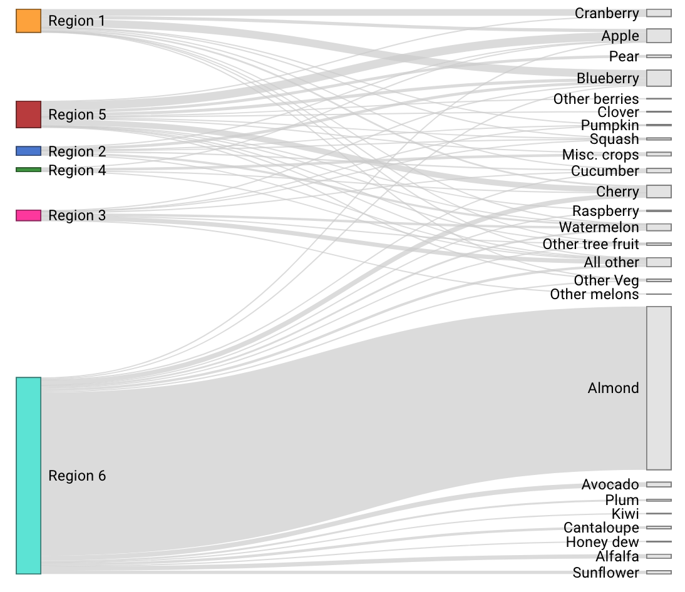

# Visualization-Bees
This is a visualization of US agricultural dependence on honey bees and their declining health status. As part of a 2 person team, I used various R libraries (e.g. network3D, igraph, ggplot, plotly, maps*) with R Shiny to make an interactive web application to eplore some of the data.

The data were all obtained from United States Department of Agriculture (USDA) websites. 

The USDA collects data on stressors to bee colonies, changes in numbers of bee colonies, honey production, and pollination costs in order to help track risk factors and mortality for our nation’s main pollinators. Specifically, 3 csv files spanning 2015-2016 were analyzed. The files consisted of numerical, categorical, as well as temporal data. Analysis focuses attention on the current decline of honey bees as well as agricultural dependence on honey bees to pollinate important regional crops. 

Bar plot and map detailing the decline of bees in various states.

 

Sankey plot and regional map detailing the dependence of certain crops on bee pollination across agricultural regions.

  

\*The libraries used include:  
library(shiny)  
library(dplyr)  
library(plyr)  
library(tidyr)  
library(reshape2)  
library(ggplot2)  
library(scales)  
library(grid)  
library(gridExtra)  
library(RColorBrewer)  
library(networkD3)  
library(plotly)  
library(maps)  
library(mapproj)  
library(cluster)  
library(gplots)  
library(reshape)  
library(igraph)  
library(shinythemes)    

To run the web app, from the R console type:

shiny::runGitHub('Visualization-Bees', 'emchinn')

